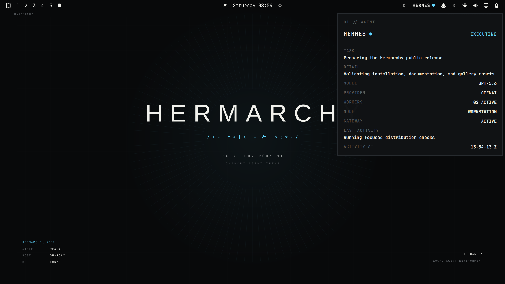
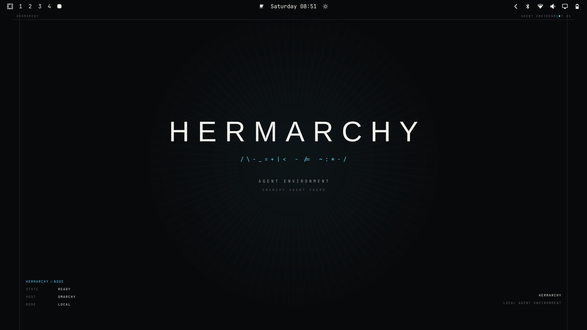
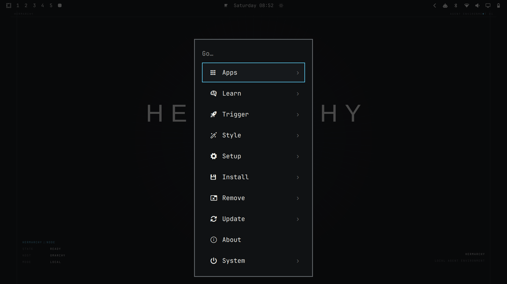
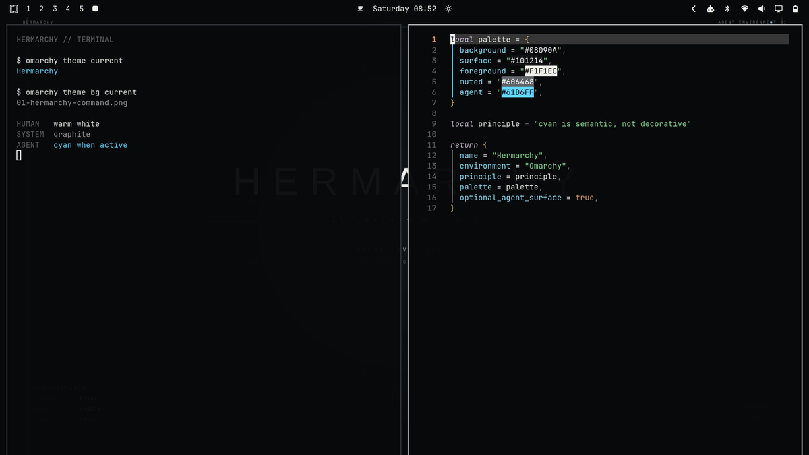
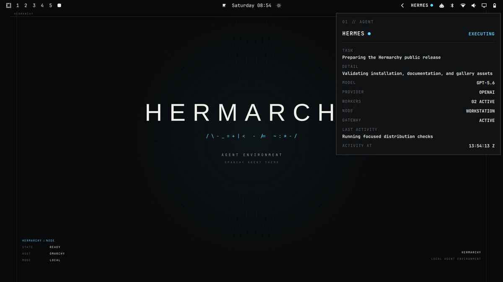
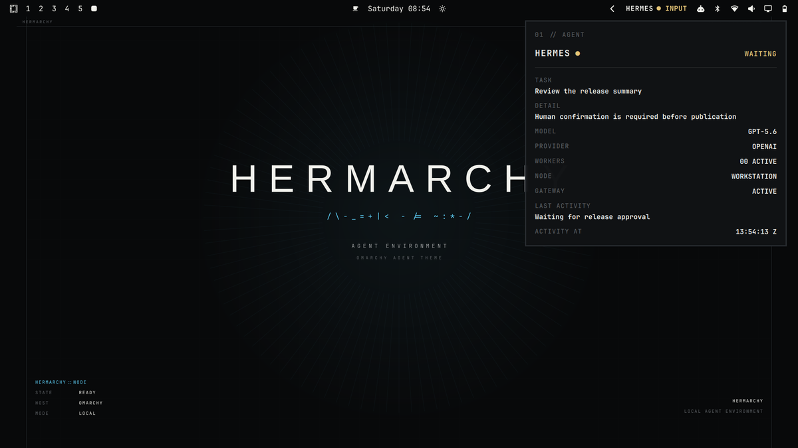
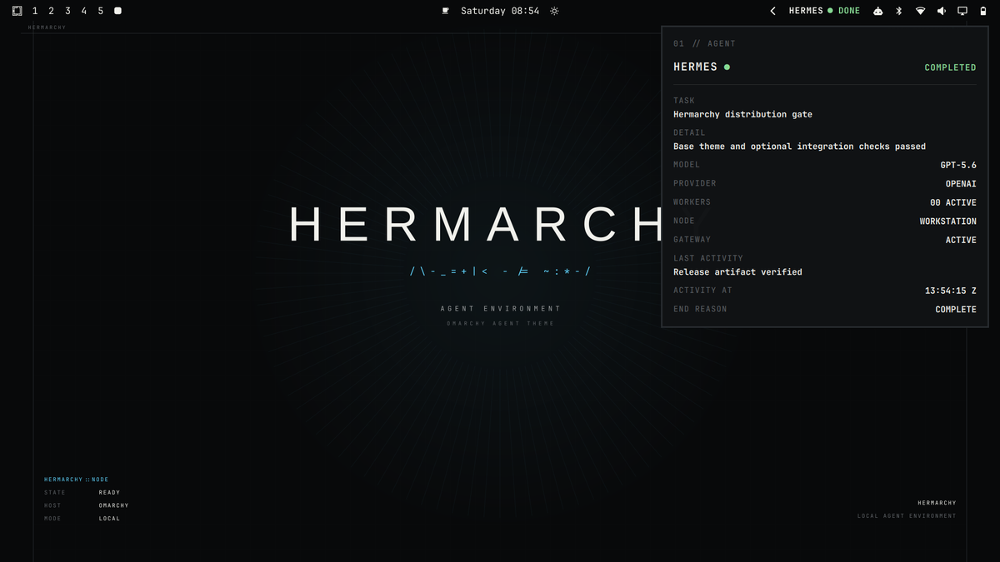

# Hermarchy for Omarchy



*Hermarchy base theme with the optional agent-aware panel enabled.*

A restrained research-workstation theme for [Omarchy](https://omarchy.org/),
with an optional Hermes-aware status surface.

## What Hermarchy is

Hermarchy coordinates Omarchy's desktop, shell, launcher, terminal/editor
palettes, notifications, browser accents, lock screen, TUI surfaces, and three
original wallpapers. It is an independent community theme; Hermes integration
is optional and separately installed.

## What it looks like

Near-black and graphite structure keep the desktop quiet. Warm white carries
human-readable content. Thin rules, sparse system labels, and compact status
surfaces provide hierarchy without glow, blur, or decorative effects.

The base installation works immediately across Omarchy's generated theme
surfaces and includes three 3840×2400 wallpapers plus a transparent lock mark.

## Cyan is semantic, not decorative

Hermarchy is approximately 95% monochrome and 5% signal color:

- warm white: human content;
- graphite: system structure and inactive state;
- cyan: active focus or agent execution only;
- amber: explicit human input;
- green/red: temporary completed/failed outcomes.

The base theme uses cyan sparingly for focus. The optional agent indicator uses
it only when validated state says an agent is executing.

## Install the base theme

In the Omarchy menu (`Super + Space`), choose **Install > Style > Theme** and
paste:

```text
https://github.com/archer-clawbot/omarchy-hermarchy-theme.git
```

Or use the terminal:

```sh
omarchy theme install https://github.com/archer-clawbot/omarchy-hermarchy-theme.git
omarchy theme set hermarchy
```

The install command activates the theme; the explicit `set` command is safe to
repeat. Cycle the included wallpapers with:

```sh
omarchy theme bg next
```

The base theme does not install Hermes, the collector, or the Quickshell
plugin. After this step, only passive theme assets and Omarchy-generated
application palettes are active.

## Optional agent-aware integration

This step is opt-in. It installs a read-only local adapter and a supported
user-local Quickshell plugin; it does not install or configure Hermes.

```sh
theme_dir="$(omarchy theme dir hermarchy)"
"$theme_dir/extras/quickshell/install.sh"
```

The bar gains a compact `HERMES` state signal. Clicking it opens a bounded panel
using only validated local state. If Hermes is absent or state cannot be read,
the indicator remains muted and reports unavailable/unknown rather than
claiming activity.

Install without enabling the bar widget:

```sh
"$theme_dir/extras/quickshell/install.sh" --no-enable
```

Then enable it later:

```sh
omarchy plugin enable io.github.archer-clawbot.hermarchy-agent --before omarchy.agents
```

See [the optional integration guide](extras/quickshell/README.md) for state
behavior and [the installation guide](docs/INSTALLATION.md) for recovery and
removal.

## Requirements

- Base theme: Omarchy v4 with `git`; no Hermes installation is required.
- Optional agent UI: Omarchy's user-local plugin API, Quickshell, Linux,
  `python3`, and `omarchy`.
- Hermes is optional. Without it, the installed agent surface fails muted.
- Current Omarchy uses Quickshell. The Waybar helper under `extras/waybar/` is a
  manual legacy path, not a current-shell fallback installed by the theme.

Verified versions and narrower compatibility claims are listed in
[docs/COMPATIBILITY.md](docs/COMPATIBILITY.md).

## Update

Update all git-installed themes, then reapply Hermarchy:

```sh
omarchy theme update
omarchy theme set hermarchy
```

The optional integration is a copied user-local payload, so update it explicitly
after the theme clone updates:

```sh
theme_dir="$(omarchy theme dir hermarchy)"
"$theme_dir/extras/quickshell/install.sh"
```

Rerunning the installer over an existing correct installation is supported.

## Uninstall or disable

Disable only the agent indicator while keeping its files:

```sh
omarchy plugin disable io.github.archer-clawbot.hermarchy-agent
```

Remove the optional plugin and, if no other workflow uses it, the adapter:

```sh
omarchy plugin remove io.github.archer-clawbot.hermarchy-agent --yes
rm -- "$HOME/.local/bin/hermarchy-agent-state"
```

Omarchy may retain an inert backup and prints its exact path. Delete that backup
only if you do not want rollback data.

Before removing an active theme, switch to another installed theme:

```sh
omarchy theme set tokyo-night
omarchy theme remove hermarchy
```

This restores normal Omarchy theming and removes only the user-installed clone.
No uninstall step edits package-owned Omarchy files.

## Troubleshooting

- Theme not listed: run `omarchy theme list` and verify `Hermarchy` appears.
- Wrong theme active: run `omarchy theme current`, then
  `omarchy theme set hermarchy`.
- Wallpaper does not change: run `omarchy theme bg current`, then
  `omarchy theme bg next`.
- Agent indicator missing: run `omarchy plugin list --json`, rescan with
  `omarchy-shell shell rescanPlugins`, then run the documented enable command.
- Agent state is muted: run
  `"$HOME/.local/bin/hermarchy-agent-state" collect`; unavailable is expected
  when Hermes is absent.
- Partial optional install: rerun the same explicit installer. It replaces the
  collector and plugin as one validated user-local transaction.

Detailed first-run, update, recovery, and uninstall steps are in
[docs/INSTALLATION.md](docs/INSTALLATION.md).

## Architecture and safety boundaries

The base theme is passive. Omarchy clones it to
`~/.config/omarchy/themes/hermarchy`, filters executable theme inputs, and
stages colors/assets into its user state. Hermarchy does not modify
`/usr/share/omarchy`, `/usr/bin`, package-owned Quickshell, global Hyprland
configuration, or Hermes runtime state.

The optional integration installs only:

- `~/.local/bin/hermarchy-agent-state`;
- `~/.config/omarchy/plugins/io.github.archer-clawbot.hermarchy-agent`.

It reads bounded local structured state, validates it, and fails muted. It does
not start Hermes, contact remote nodes, invent telemetry, or patch the native
shell. See [DESIGN.md](DESIGN.md) and the
[agent contract guide](extras/agent-integration/README.md) for deeper details.

## Gallery

| Surface | Preview |
|---|---|
| Base desktop |  |
| Launcher |  |
| Terminal and editor |  |
| Optional: executing |  |
| Optional: waiting for input |  |
| Optional: completed |  |

The gallery uses real Omarchy captures. Optional agent images are labeled so
they do not imply that the base theme installs Hermes.

## Development and testing

Artwork source lives under `assets/source/`; rebuild wallpapers and the lock
mark with `python3 scripts/build_assets.py` after installing `librsvg`. The
artwork build never creates the real desktop preview.

Run the distribution and integration suites with:

```sh
python3 -m unittest \
  tests.test_distribution tests.test_agent_state tests.test_quickshell_plugin -v
QT_QPA_PLATFORM=offscreen /usr/lib/qt6/bin/qmltestrunner \
  -input tests/quickshell -import /usr/share/omarchy/shell
```

Release history and current limitations are in [CHANGELOG.md](CHANGELOG.md).
Original artwork and code are MIT licensed; see [LICENSE](LICENSE) and
[NOTICE](NOTICE).
